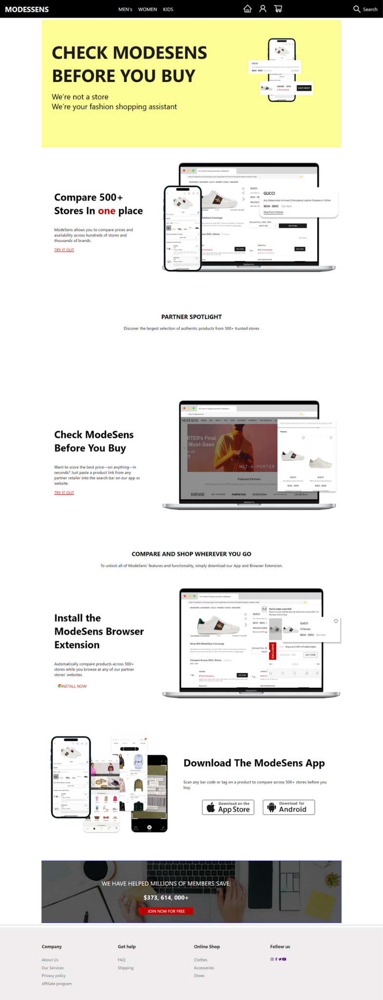
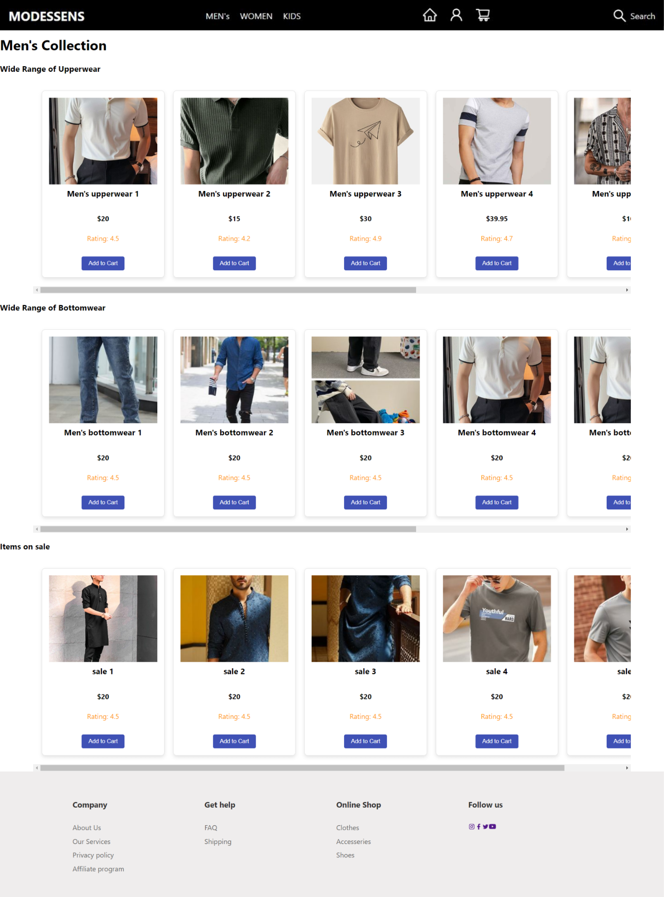
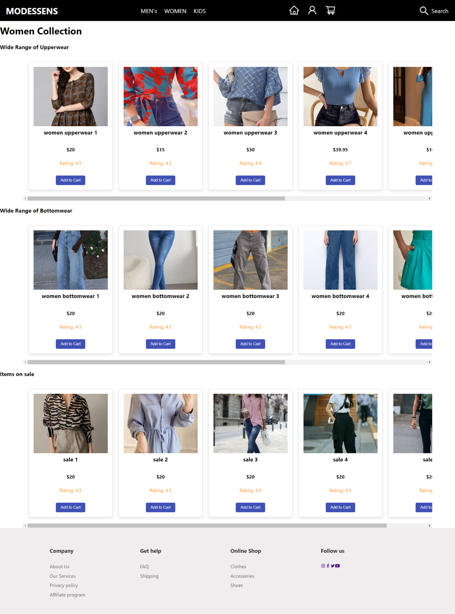
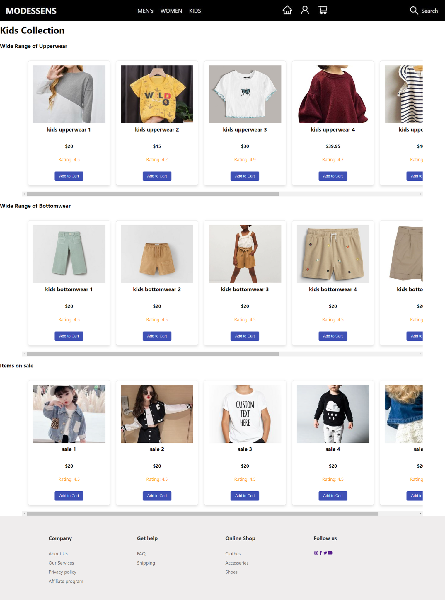
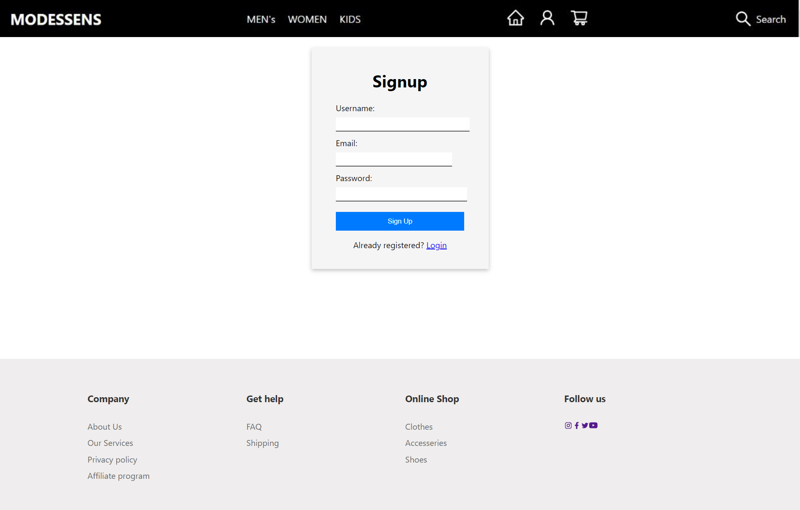
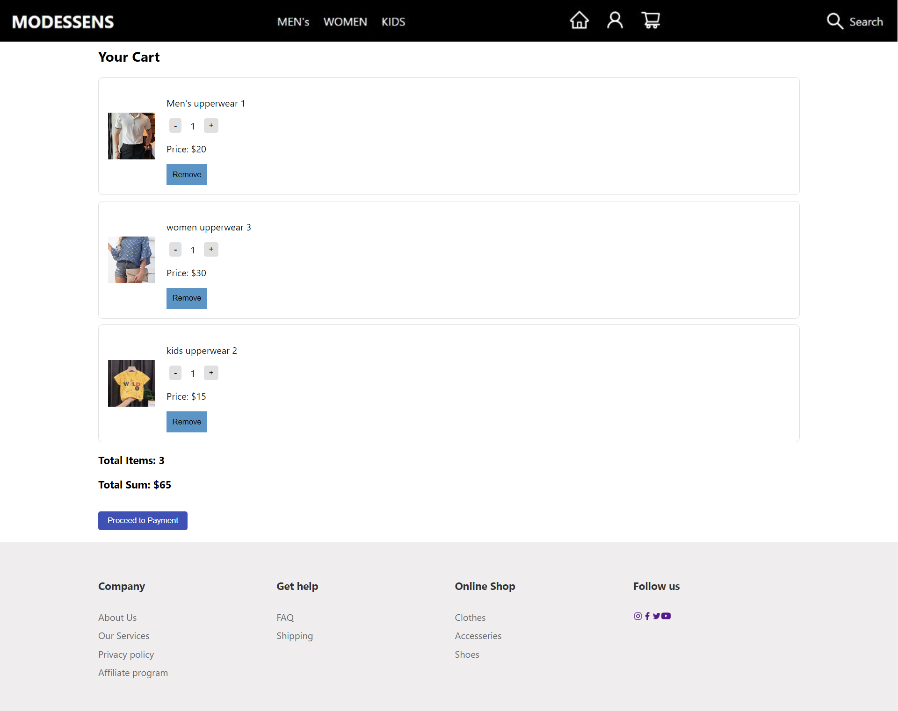

# Welcome to ModeSens Clone!

**🌐 PROJECT DESCRIPTION 🌐**\
ModeSens Clone is an ambitious website clone project aiming to replicate some of functionality and design of ModeSens, a leading fashion shopping platform. Our goal is to recreate the immersive shopping experience offered by ModeSens, providing users with access to a vast collection of high-end fashion products from renowned brands and designers.

\
**⚠️ DISCLAIMER ⚠️**\
Please note that this is an ongoing project, and we are actively working on adding more features and improving the overall user experience. Your feedback and contributions are valuable to us as we strive to make ModeSens Clone a top-tier shopping destination for fashion enthusiasts.

\
**Stay tuned for updates and happy shopping! 🛍️**

## Technology Used:

**Visual Studio Code:**\
A source code editor developed by Microsoft for Windows, Linux and macOS. It includes support for debugging, embedded Git control, syntax highlighting, intelligent code completion, snippets, and code refactoring.

\
**Client:**

- HTML - HyperText Markup Language (.html files) 
- CSS - Cascading Style Sheets (.css files)
- JS - JavaScript (.js files)
- ReactJS (.jsx files)

**Server:** 
## 📝Like what you see?

Within the download you'll find the following directories and files, logically grouping common assets and providing both compiled and minified variations.\
You'll see something like this:

```README.md
-modessens-project-

|-> frontend
    |--> node_modules
    |--> public
    |--> src
        |--> component
            |-- Footer.css
            |-- Footer.jsx
            |-- Nav.jsx
            |-- ProductCard.jsx
            |-- ProductList.jsx
            |-- ProductSlider.jsx
        |--> pages
            |-- About.jsx
            |-- Card.jsx
            |-- Contact.jsx
            |-- Home.css
            |-- Home.jsx
            |-- Kids.jsx
            |-- Login.jsx
            |-- Men.jsx
            |-- Searh.jsx
            |-- Signup.jsx
            |-- Women.jsx
        |--> router
            |-- Allrouter.jsx
        |-- App.css
        |-- App.jsx
        |-- App.test.js
        |-- index.css
        |-- index.js
        |-- logo.svg
        |-- reportWebVitals.js
        |-- setupTests.js
    |-- .gitignore
    |-- db.json
    |-- package-lock.json
    |-- package.json
    |-- README.md
    |-- user.json

```

## Installation:

To set up the project locally, follow these steps:

## Screenshorts:







## 🚀About Us!

Hello Everyone...

Welcome to Dev Dynasty, a talented team of aspiring developers passionate about web development. Our beginner-level project, ModeSens Clone, showcases our dedication to learning and growth. ModeSens Clone is an homage to the original fashion shopping platform, recreated with simplicity and elegance. We aim to provide users with a basic yet functional experience, reflecting our commitment to delivering quality web solutions. As we continue our journey, we welcome your feedback and support, which fuels our drive to become better developers and create more exciting projects in the future.

\
**👥TEAM MEMBERS:**
- Shubhranshu Das - @shubh  
- Richa Kumari - @richavashistha19
- Khushi Vats - @KhushiVats25
- Anwesh Kumar Pani - @Anweshh
- Alisha Kumari - @Alishakumari112
- Ranjit Sahu - @AbRanjit07

\
Thank you for joining us on this exciting endeavor!
